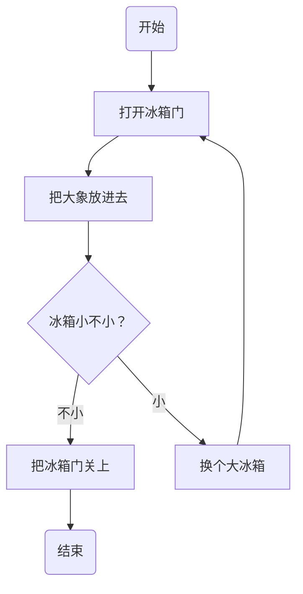
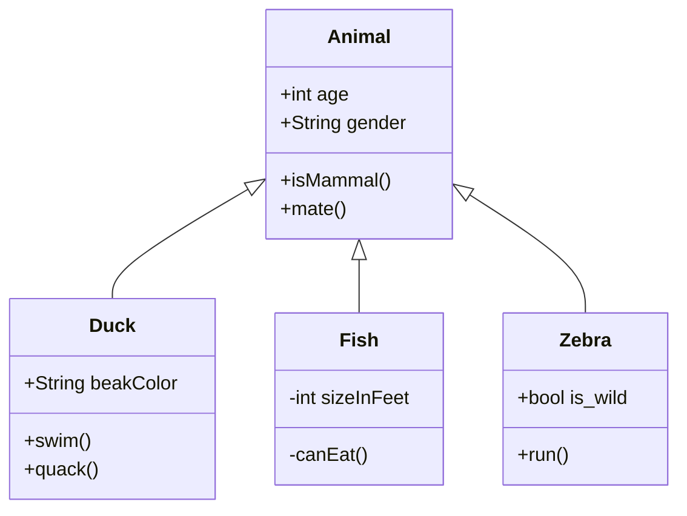
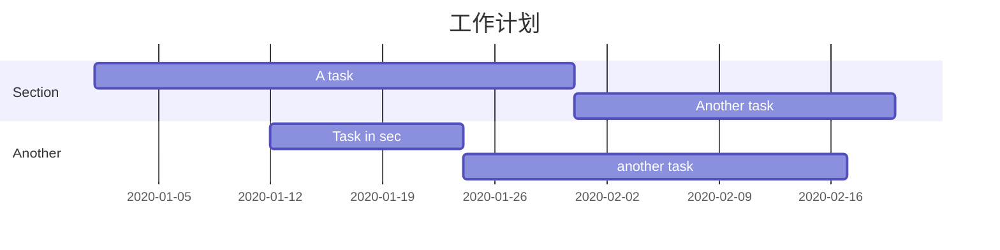
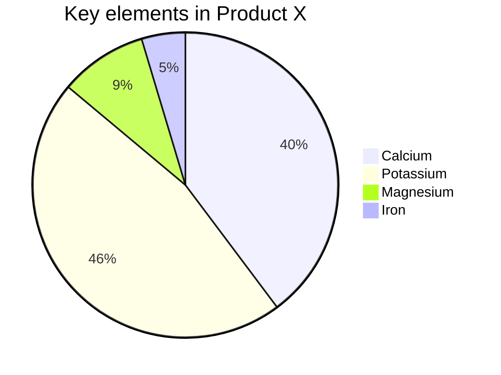

常用語法範例


*改變圖片大小:
```
{:height="50%" width="50%" zoom="50%"}
```

```

```

<table>
    <tr>
        <td>Foo</td>
    </tr>
</table>

![[components-learning-card.pdf]]


---
### 畫流程圖


---
### 類圖
语法解释：<|-- 表示继承，+ 表示 public，- 表示 private，学过 Java 的应该都知道。


---
### 甘特圖


---
### 餅圖



有關markdown繪圖都可以到[mermaid](https://mermaid-js.github.io/mermaid/#/)尋找

---
### 表格
插入表格

| 表头1 | 表头2 |
| --- | --- |
| 单元格1 | 单元格2 |
| 单元格3 | 单元格4 |


---
### 代辦事項
TODO:
- [ ] knowledge
- [x] done 


hashTag
#markdown #mermaid #flowchart